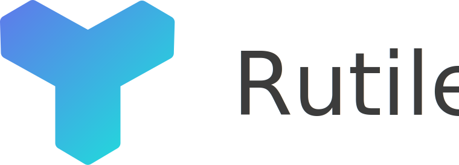

# Rutile
Rutile is a decentralized platform for executing scripts, storing files keeping a global state.
Rutile is not based on blockchain but rather on a Directed Acyclic Graph (For example The Tangle in IOTA). This allows for fee less transactions, better scalibility and faster confirmations.

Rutile is currently in development but is actively worked on.

For more information see: https://rutile.io
